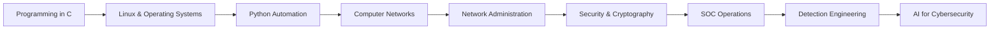

<div align="center">


<br/>


<br/>


</div>

---

## 🧠 whoami

<div align="center">


</div>

---

## 🚀 About Me

- 🎓 DUT SIR student in **Sécurité Informatique et Réseaux**.
- 🧱 Strong foundation in **C, Python, C++, Linux, databases, cryptography, networks and cloud/virtualization**.
- 🛡️ Interested in **SOC analysis, SIEM, log analysis, threat hunting, detection engineering and incident response**.
- 🤖 Building hands-on projects around **AI-powered alert triage, SOC automation and network security monitoring**.
- 🧪 Practicing through **CTFs, TryHackMe labs and defensive cybersecurity scenarios**.

---

## 🌐 Connect with Me

<p align="center">
  <a href="mailto:adam.ghanem.it@gmail.com">
    
  </a>
  <a href="https://www.linkedin.com/in/adam-ghanem-2326b9336/" target="_blank">
    
  </a>
  <a href="https://tryhackme.com/p/ADMiR4L" target="_blank">
    
  </a>
  <a href="https://github.com/Adam-Ghanem" target="_blank">
    
  </a>
</p>

---

## 🧰 Skills & Tools

<div align="center">


<br/>

`C` · `Python` · `C++` · `Bash` · `Linux` · `Windows` · `Docker` · `SQL/NoSQL` · `Git` · `GitHub` · `VS Code`

</div>

---

## 🛡️ Cybersecurity Focus

<p align="center">
  
  
  
  
  
  
  
  
  
  
</p>

---

## 🔥 Featured Cybersecurity Projects

<table>
<tr>
<td width="50%">

### 🤖 AI SOC Copilot
AI-assisted SOC investigation workflow for alert explanation, IoC enrichment and analyst decision support.

**Focus:** AI + SOC Automation  
**Value:** Faster alert understanding and cleaner investigation notes

</td>
<td width="50%">

### 🚨 Autonomous Alert Triage Engine
Automated security alert classification, enrichment and priority scoring for SOC environments.

**Focus:** Detection Engineering  
**Value:** Reduces noise and helps analysts focus on important alerts

</td>
</tr>
<tr>
<td width="50%">

### 🕵️ Threat Hunting Lab Platform
Hands-on lab platform for hunting scenarios, IoCs, logs and detection validation.

**Focus:** Threat Hunting  
**Value:** Turns theory into practical blue-team investigations

</td>
<td width="50%">

### 🧭 Attack Path Detection Engine
Maps possible attack paths and highlights defensive control gaps from security evidence.

**Focus:** Security Analysis  
**Value:** Improves visibility into risky paths and weak controls

</td>
</tr>
<tr>
<td width="50%">

### ☁️ Cloud Security Posture Monitor
Monitors cloud misconfigurations, exposed services and posture weaknesses.

**Focus:** Cloud Security  
**Value:** Helps detect risky configurations before they become incidents

</td>
<td width="50%">

### 🌐 NetWatch
Network monitoring project for host visibility, service status and infrastructure health tracking.

**Focus:** Network Monitoring  
**Value:** Builds a strong foundation for SOC visibility

</td>
</tr>
</table>

---

## 🎯 Currently Building

```txt
[+] AI-powered SOC investigation assistant
[+] Autonomous alert triage and enrichment engine
[+] Threat hunting labs with logs, IoCs and reports
[+] Network monitoring and security visibility tools
[+] Clean cybersecurity reports for portfolio projects
```

---

## 🧩 Learning Roadmap



---

## 📊 GitHub Analytics

<p align="center">
  
  
</p>

<p align="center">
  
</p>

<p align="center">
  
</p>

<p align="center">
  
</p>

---

## 🐍 Contribution Snake

<p align="center">
  
</p>

> Note: the snake animation needs a GitHub Actions workflow to generate the SVG inside the `output` branch.

---

<div align="center">

### ⚡ Learning by building. Breaking to understand. Defending to protect.


</div>
