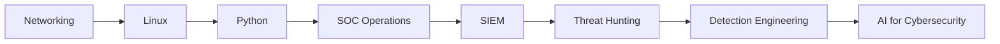

<div align="center">

# 👋 Hi, I'm Adam Ghanem

### Cybersecurity & Networking Student | SOC Analyst in Progress 🇲🇦


<br/>


</div>

---

## 🧠 Whoami

```txt
name        : Adam Ghanem
role        : Cybersecurity & Networking Student
track       : SOC Analyst / Blue Team
location    : Morocco 🇲🇦
interests   : SIEM, Threat Hunting, Incident Response, Network Security, AI for Cybersecurity
contact     : adam.ghanem.it@gmail.com
```

---

## 🚀 About Me

- 🎓 DUT SIR student — **Cybersecurity & Networks**
- 🛡️ Focused on **SOC Analysis, SIEM, Threat Hunting, Network Defense and Incident Response**
- 🤖 Building practical projects around **AI-SIEM, autonomous alert triage, WiFi security auditing and log analysis**
- 🧠 Learning **Blue Team operations, detection engineering, Python automation and cloud security**
- 🏆 Practicing through **CTFs, TryHackMe labs and real-world defensive security scenarios**
- 🎯 Goal: become a strong **SOC / Detection Engineer** with real hands-on projects

---

## 🌐 Connect with Me

<p align="center">
  <a href="mailto:adam.ghanem.it@gmail.com">
    
  </a>
  <a href="https://www.linkedin.com/in/adam-ghanem-2326b9336/" target="_blank">
    
  </a>
  <a href="https://tryhackme.com/p/ADMiR4L" target="_blank">
    
  </a>
  <a href="https://github.com/Adam-Ghanem" target="_blank">
    
  </a>
</p>

---

## 🧰 Tech Stack

<p align="center">
  
</p>

---

## 🛡️ Cybersecurity Arsenal

<p align="center">
  
  
  
  
  
  
  
  
  
  
</p>

---

## 🔥 Featured Cybersecurity Projects

| Project | Focus | Description |
| --- | --- | --- |
| **NetWatch** | Network Monitoring | Visibility, host/service monitoring and network status tracking. |
| **ai-soc-copilot** | AI + SOC | AI-assisted SOC investigation, alert explanation and triage support. |
| **autonomous-alert-triage-engine** | Detection Engineering | Automated security alert classification, enrichment and prioritization. |
| **threat-hunting-lab-platform** | Threat Hunting | Lab platform for hunting scenarios, IoCs and detection validation. |
| **attack-path-detection-engine** | Security Analysis | Attack path analysis and defensive detection logic. |
| **cloud-security-posture-monitor** | Cloud Security | Monitoring cloud misconfigurations and security posture indicators. |

---

## 📊 GitHub Analytics

<p align="center">
  
  
</p>

<p align="center">
  
</p>

<p align="center">
  
</p>

---

## 🎯 Current Focus

```txt
Blue Team Operations  █████████░  90%
SIEM & Log Analysis   ████████░░  80%
Python Automation     ████████░░  80%
Network Security      ████████░░  80%
Threat Hunting        ███████░░░  70%
Cloud Security        ██████░░░░  60%
```

---

## 🧩 Learning Path



---

<div align="center">

### ⚡ Always learning. Always building. Always securing.


</div>
